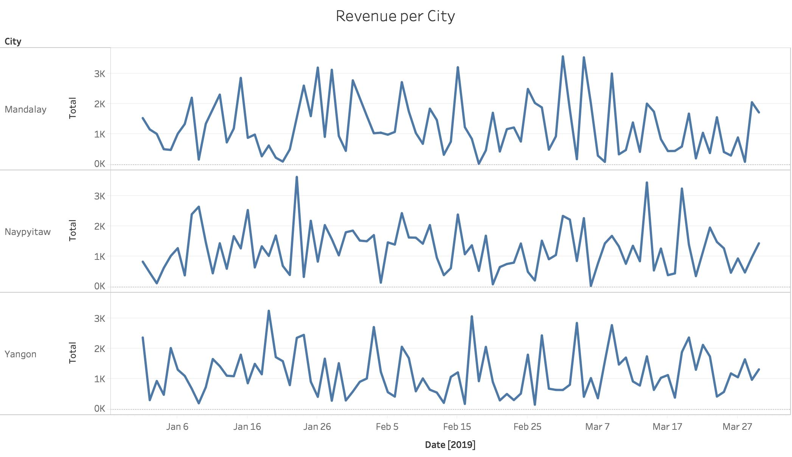
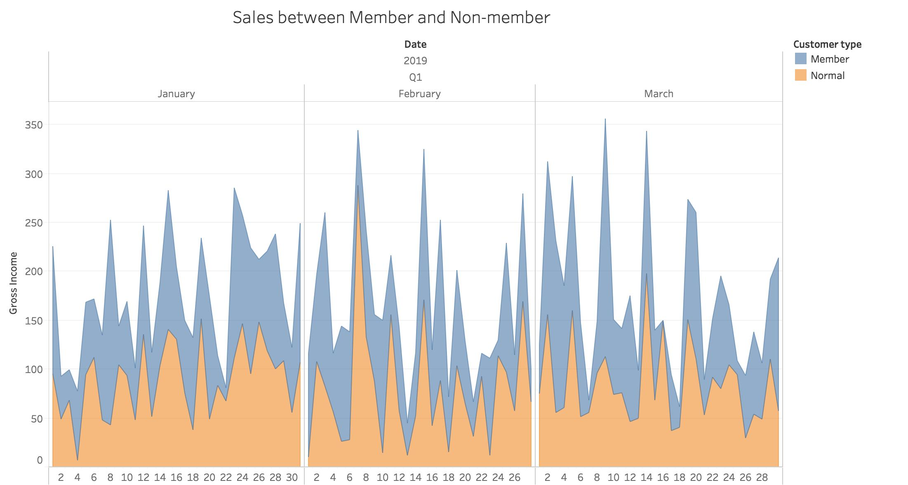
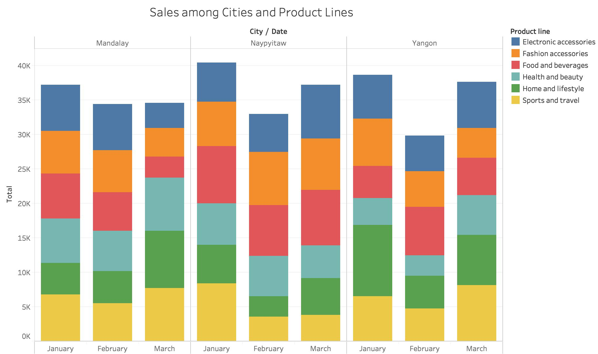
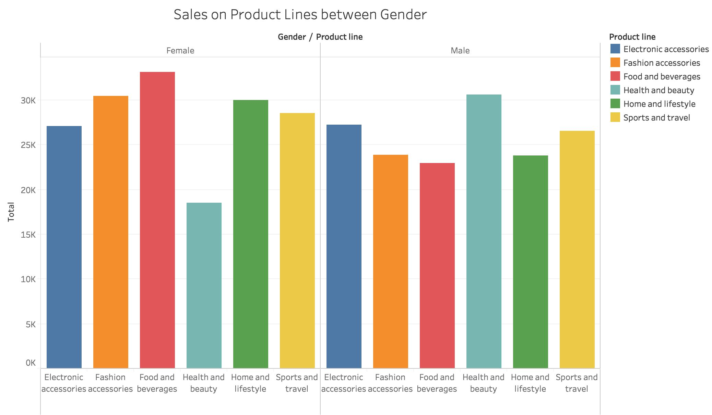
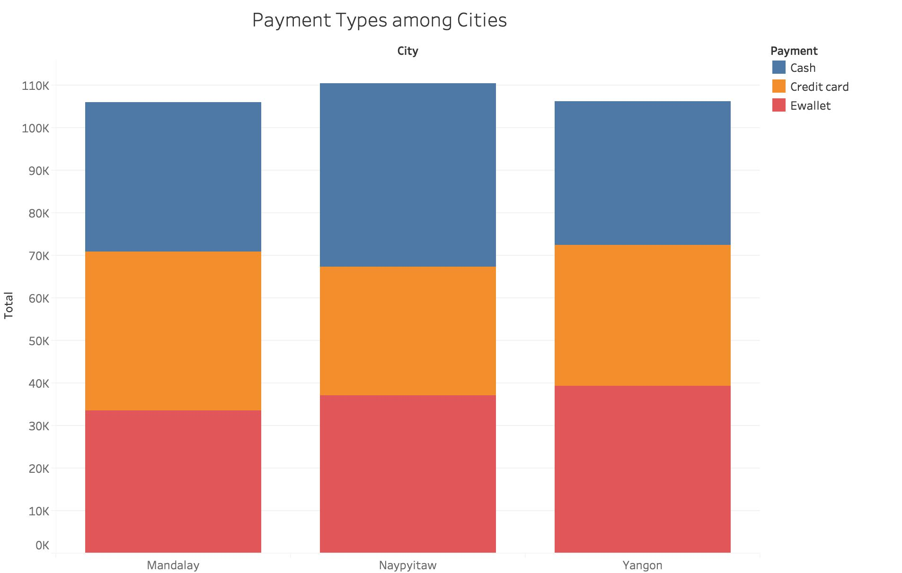
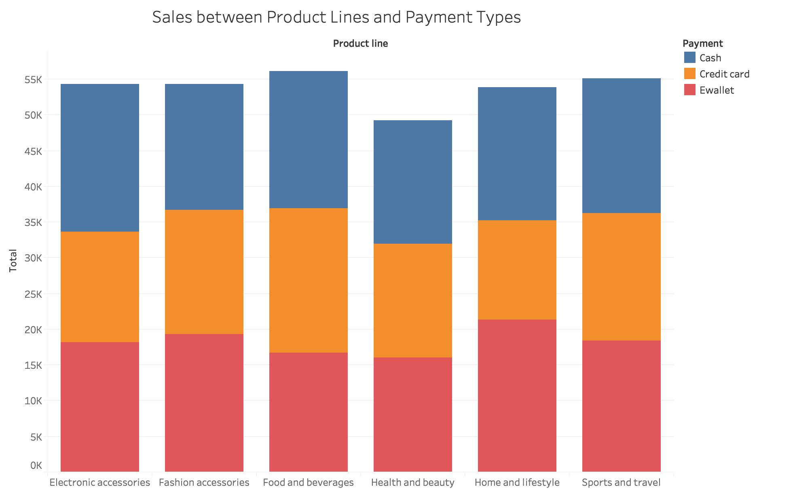
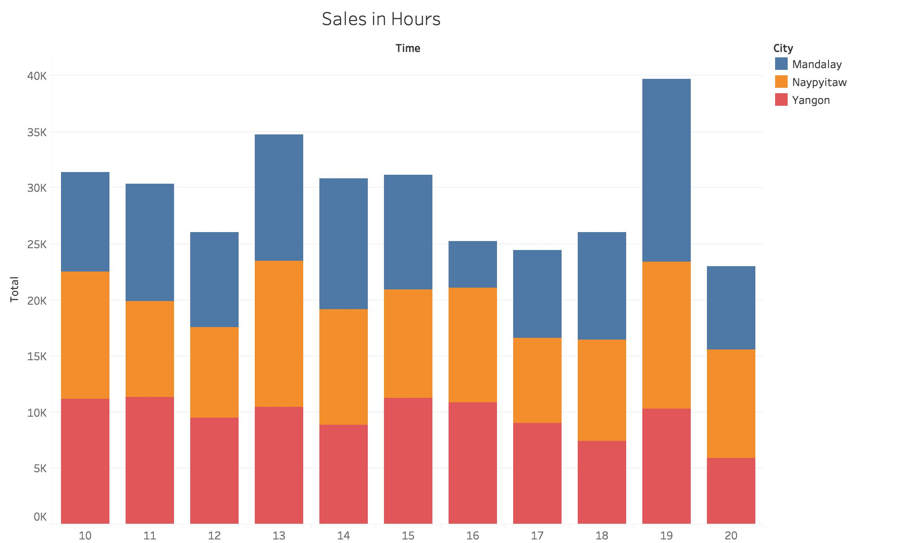

# Exploratory Data Analysis
In this phase, we are going to explore the data insight from the data set of the Burma supermarket chian sales data. Our goal is to understand more about data set in order to raise some business questions and gain insight when doing data engineering work.

## Strategy and Files
We will use Tableau to make some visualization to explore the relationship between features and sales in the data set. Then, we will observe the relationship and correlation to find interesting fact in order to raise questions.
  
In this folder, we have a Tableau file EDA_supermarketsales.twb and 7 images of visualizations. 

## Sales per City
The first step is to find the sales related to City. In this data set, the stores are located in 3 Cities in Burma - Mandalay, Naypyitaw, and Yangon. The date range is between Jan and March in 2019. We ploted 3 line charts which are aligned again date on X-axis. 

 
From the line chart, we can see there is a seasonality on sales in all 3 cities. The sales trend are roughly the same in all 3 cities. We can also see that date may be play a role in prediction model. 

## Sales between Member and Non-member
The second step is to find the sales related to customer type. There is only 2 customer type - Member and Normal(Non-member). We plot a stacked line chart to visualize the sales data between member and non-member against date. The result looks like this: 

 
From the stacked line chart, we can identify the sales between member and non-member. We can see that most of the time, especially in January and March, the sales from member is higher than non-member. We cannot judge whether this is true from the visuailzation. We may find out whether this is true by conducting A/B testing. 

## Sales by Product Classes among Cities and Months
The third step is to find the relationship between Product classes and cities, and between Product classes and months. We plot a stacked bar chart where each bar is stacked with sales of each product line on a monthly basis and partitioned by city. The result looks like this: 

 
From the visualization, we see that the sales in the data set among product line are roughly the same in all cities and months, expect one or two product. Also, we can see that the monthly total sales are similar among cities as well. 

## Sales by Gender and Product Classes
The next step is to find the correlation between gender and product classes. In this step, we want to see the shopping preference on both gender. We plot a bar chart by product line partitioned by gender. The result looks like this: 

 
The visualization shows that both gender do not have an obvious preference on the products available in this supermarket chain, except Food and beverages and Health and beauty. Unexpectingly, we can see that there is more male customer purchasing Health and beauty products in the data set. We may also find whether this is true by conducting A/B testing.

## Sales by Payment Type
The following step is to find if there is any correlation on sales and payment type. We are interested whether different city prefers one type of payment or which payment type is likely to be used when purchasing different products. First, let's look at payment types used among Cities. We plot a stacked bar chart on payment types among cities. The result looks like this: 

 
From the stacked bar chart, we see the shares of payment types on 3 cities are almost the same. We can see that there is no obvious correlation on payment type preference among 3 cities. Then, we will see which payment type is likely to be used when purchasing different products. Similarily, we plot a stacked bar chart on payment types, but against product lines. The result looks like: 

Similarily, there is no obvious correlation on payment type preference with product lines. It means the payment type preference does not change on neither product types purchased nor the location where the transaction is taken place. Therefore, we can say that the payment type preference does not change in general when any feature changes. 

## Sales by Hours
We know that retail sales has a high correlation with date or time. So, let's find out the correlation betwwen sales and store hour by plotting a bar chart. The result looks like this:
 

 
We can see that some store hours have low sales number, the sales peak at 1PM and 7PM that indicates lunchtime and afterwork-hour are the time the supermarket experience higher sales. Therefore, there is a correlation between store hour and sales.

## Conclusion
We have looked at the relationship between sales and features in the data set. Although the data set only contains selective data from the supermarket chain, it is still useful to find out some insights with the sales data. In the exploratory data analysis phase, we are able to identify there are sales trend and seasonality in the data set and have a simple idea on how the trend and seasonality looks like in the data set. There is no obvious payment preference on consumers. Male and female consumers do not have any preference on most of the products available, expcept Male consumers purchase more health and beauty products. Lastly, Member contribute more sales than non-members.
  
In this phase, we have raised two phases:
* Is the sales from members more than the sales from non-members?
* Is the sales of Health & Beauty from Male more than the sales from Female?
 
In the next phase, we would conduct A/B testing to answer those questions that might be helpful for future business planning. After the next phase, we would also leverage some insight found in this phase to pick or engineer the features for prediction model training. 
  
You may find the findings and results in the <a href="https://github.com/jacquessham/SalesAnalytics/tree/master/BurmaSupermarket/ABtesting">A/B Testing folder</a>