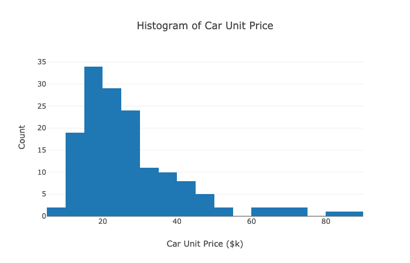

# Exploratory Data Analysis
The EDA phase is to understand the data insight in the original data set in order to help make analysis on car sales and pick features to build prediction model.
  
The analysis will be displayed in the <i>Result</i> section or you may run the dashboard on your own to find the analysis. 

## Background and Strategy
We have a car sales data set from a US car dealership from Kaggle. In this phase, our goal is to understand the data distribution of the data set to help us to build adashboard and a prediction model for management purpose. We would use Plotly to build visualization and embedded in Dash in a markdown format. 

## Files
We have 2 python files and 11 images (In the Images folder). The Python files are:
<ol>
	<li>Carsales_eda.py - Driver Program</li>
	<li>Layout.py - Helper code for Carsales_eda.py</li>
</ol>
 
Carsales_eda.py is the driver program to display the analysis in a markdown format dashboard by Dash. This program first manipulate and engineer the data, then set up the dashboard base layout. The program relies on Layout.py to define the detail layout of each component. All the text related to description and analysis are saved in Layout.py, as well as the function to generate Plotly charts. Note that the graphs are static, therefore, there is no callback function set in this program.

## Result
The first step on making prediction model of car sales is to
understand the data set. The data set contains the sales and
car features of each car model available in this dealship.
Each observation represents a car model and the
aggregated sales of the whole production lifetime of the car
model. In the data set, it includes the make, model, features
(such as length, width, fuel efficiency), price, and sales of
each car model. 
 
In order to understand the data set, we will
use Dash and Plot to visualize the data with bar charts,
histogram, and scatter plots in a markdown format. The data
set treat replace Null data into a period. We will use Pandas
to read the data set and replace the period to numpy nan.
From there, we replace nan to 0 for resales value first. Then,
if there are missing values for price or features, we will drop
that observation because it does not make sense to have 0 for 
price or features.
 
We will first look at the sales of the cars of each make.
 

 
We can see the sales of Ford cars outperformed to other
brands. It followed by Chevrolet, Dodge, Honda, and 
Toyata. The sales of the remaining available brand does
not seem to make up the large share of the sales.
 Since each car has a different price tag, the revenue 
of each model is not the sales. We shall also look the 
revenue by make. 

 
We can see the revenue by selling Ford cars has the
highest share in the dealership. The revenue share by 
selling other available brands are almost the same. We
can see that Ford cars are the main revenue driver in 
this dealership.
 
The next step is to understand the demographic of the 
car models available in this dealership. We will look
at the unit price of the cars. We will use a histogram
to display the count of cars in each unit price range.

 
We can see that most of the cars sold in this
dealership sell in $15,001-$20,000, $20,001-$25,000,
and $25,001-$30,000 price range. 
 
Resales value is one of the factors customers
consider when they purchase a car. In the
data engineering part, we have convert the resales
ratio by divided the 4 years resales value from
the unit price. We have also used a histrogram to
display the distribution of the resales ratio of
car models.
 

 
We can see most of the cars has a resales ratio
between 0.60 and 0.65. There are cars with 0
resales ratio because the resales value of such
cars is missing. It could be there is no resale
market for such car model or simply no resale
value. For cars without resale value, these car
models make up a large share of the sales. Most
cars have a resales value between 0.60 and 0.80
range if the resale value is available.
 
Then, we will compare car sales with the car price.
We will plot the data on a scatter plot.
 

 
We can see that most of the data cluster between
$10,000 and $30,000 range. And we can see an
approximately downward-sloping relationship
between sales and price, as expected. We can see
that the sales of expensive cars is less than
inexpensive cars. Note that the y-axis is in
log scale, the relationship may be more extreme
than it is on the plot.
 
In the previous histogram, we have see that most
of the cars have a resales ratio between 0.60
and 0.80 but let's see the relationship between
resales ratio and car sales.
 

 
Most of the data are clustered in between 0 and
100,000 that we can see the relationship between
resales ratio and car sales is not strong. Also,
we cannot see the obvious pattern of the scatter
plot that suggests the relationship could 
potentially do not exist.
 
Car performance is another factors customers may
purchase a car. One of the indicators of car 
performance is the horsepower of the car. Let's plot
another scatter plot to show the relationship between
sales and horsepower.
 

 
Most of the cars' horsepower are in the range between
100 horsepower and 250 horsepower. There is a inverse
relationship between sales and horsepower that the 
sales of smaller horsepower cars is stronger. However,
the relationship is weak as the downward-sloping 
relationship is not too obvious. 
 
Fuel efficieny is another important feature when
selling a car. We would also like to explore the 
relationship between sales and fuel efficieny on
a scatter plot.
 

 
The data distributed evenly that there is no obvious
pattern of the relationship between fuel efficiency
and sales. It means the customers do not value the
fuel efficiency of the available car as one of the
important features.	
 
We can determine the size of cars by length and width.
Compact cars have shorter and narrower body;
while Pickup trucks and SUV have longer and wider body.
We know that Pickup trucks and SUV sell more than
compact cars in the United States. So we can compare 
the relationship between length or width and sales to
interpreted as the relationship between larger cars
and sales. However, larger cars may not mean wider cars
because there is restriction on width of cars. Let's
look at the histogram of car width to verify most of
the cars have similar width.
 

 
Most of the cars have a car width between 66 and 75
inches that indicates that most of the cars have
similar width that the relationship betwen width and
sales may not be useful for prediction model.
 
Let's continue by comparing length and sales.
 

 
We can see there is a upward-sloping relationship
between length and sales that we can confirm the
longer cars is more popular. We can see that length
may be a better feature for prediction model. We
may use this relationship to interpreted the theory
of larger cars sell better in the United States.
 
Lastly, let plot a bar chart of the correlationship among
features and car sales. 
 

 
As the result, we can see that engin size, curb weight,
fuel efficiency does not have a significant correlation
with sales. Wheelbase and length are important features
affect car sales, followed by list price. Now, we can
use these result to select feature in the model training
phase.

## Next Step
The next step is to build a dashboard for management to look at the relationship between car sales and car features of car models available in the car dealership. You may find more detail and the dashboard screenshot in the [Dashboard folder](../Dashboard)
