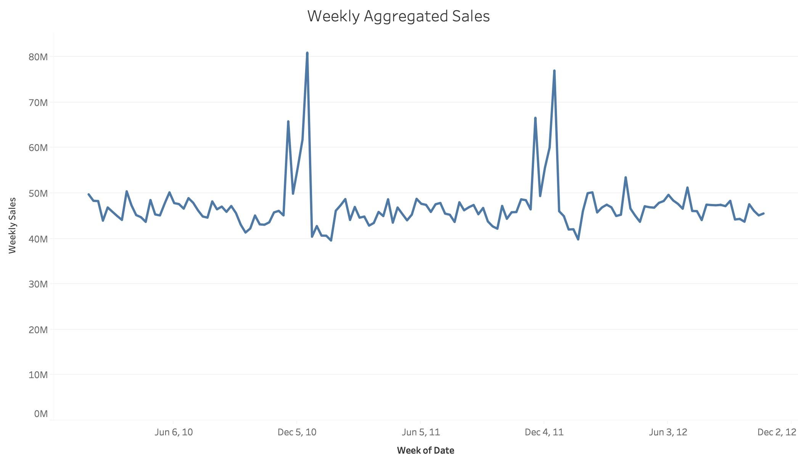
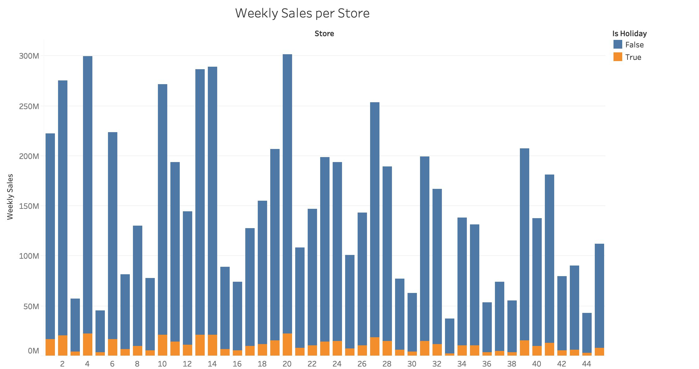
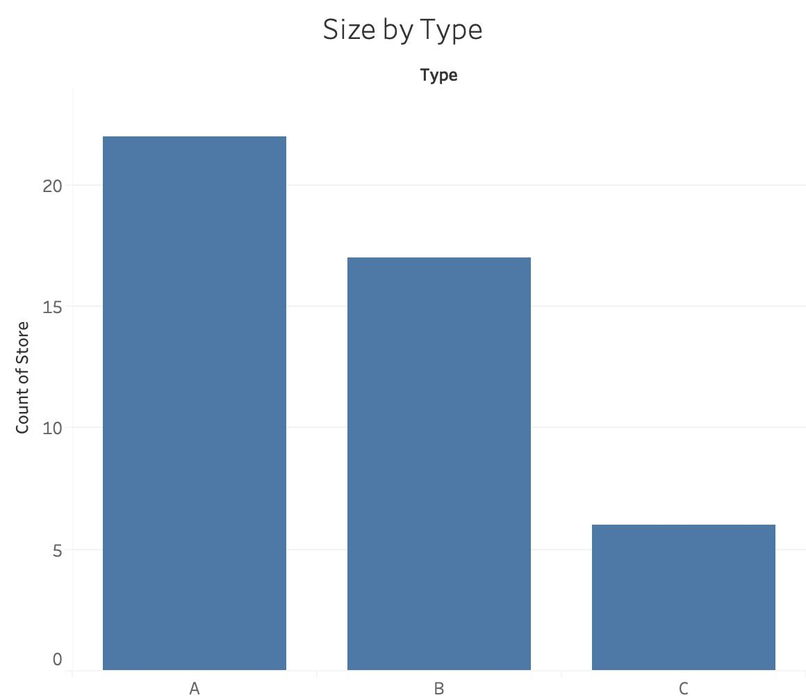

# Exploratory Data Analysis (EDA)
In this phase, we are going to explore the data insight from the data set of the Burma supermarket chian sales data. Our goal is to understand more about data set in order to answer some business questions and gain insight when doing data engineering work.

## Strategy and Files
We will use Tableau to make some visualization to explore the relationship between features and sales in the data set. Then, we will observe the relationship and correlation to find interesting fact in order to raise questions.
  
In this folder, there are 3 Tableau files and 9 images of visualization. 
 
Tableau files:
* EDA_usretail.twb - EDA made for sales data set
* EDA_usretail_features.twb - EDA made for feature data set
* EDA_usretail_storesize.twb - EDA made for store data set

## Sales in Date
The first step is look at the business-wide sales across time. The data set consists sales date between 2010 and 2012. The sales across time looks like below:
 

 
We can see the trend of the sales is flat but we can see the sales peak during holiday season in November and December. We have learnt that the seasonality exists and peaks during holiday season. 

## Sales across Stores and Departments
The next step, we will look at sales acorss stores and departments. The stores and departments are labeled in number. There are about 45 stores, in each store, there are about 99 departments. We will first look at the sales distribution across 45 stores. It looks like this:
 

 
We can see that the sales distribution is quite balance across 45 stores, but there are about 10 stores have below-average sales. If we have to take holiday be consideration. The result looks like this:
 

 
We can see that the holiday sales across all stores do not have a large share against total sales. We can see that the sales in non-holidays have a larger share than the sales in holidays.
  
In the next step, we will look at the sales distribution across 99 department by aggregated sales by department. The aggregated sales per department across all stores look like this:
 

 
We can see that there are about 7 departments have the highest sales compared to other departments. Also, we can see that there are 10-15 departments contribute insignificant share of sales.

## Macro Data 
Macro data are the data in the feature data set. Because the data in this data set describes the enviornment observation of each store, therefore, I call it Macro data. There are 4 indicators available in the feature data set: median fuel price, median Consumer Price Index (CPI), median unemployment rate, and median temperature. 
 

 
The fuel price stays flat below $3 in 2010 and rise above $3 afterward. The fuel price stays the same between $3 and $4 between 2012 and 2013. The median CPI is increasing in a very low rate, while the median unemployment rate is decreasing steadily from 8% to 7% between 2012 and 2013. The median temperature follow the expected season weather.

## Store Size
Finally, let's look at the store size available in the store data set. There are 3 types of store size, A, B, and C. A type is large store, B is medium store, C is small store. The average size of each type looks like:
 

 
The size of each store is:
 

 
The share of each store size in the retail chain looks like this:
 

 
We can see that most of the stores are Type A, about 60% of the retail area is Type A, roughly 30% are Type B, 10% are Type C.

## Next Step
Once, we have understand the data sets. The next step is to make the prediction model. You may find the detail in the [Model Training folder](../ModelTraining)