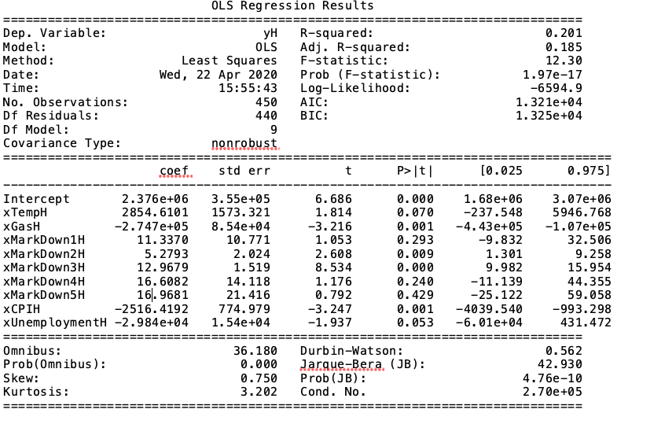

# Markdown Model
The second goal of this part of Sales Analytics is to model the effoects of markdowns on holiday weeks. In this phase, we will model the sales and feature data set in linear regression model and interpret the effects of Markdowns. The reason we are training this model with linear regression because it is easy to interpret. 

## Data
We will be using feature and sales data set but filter to the observations with holiday data. The first step is to combine the feature and sales data set and filter the observation when the column "IsHoliday" is true because we are only focus the effect on holidays.

## Packages Used
* Pandas - Read csv file and data manipulation
* statsmodels - Fit model and return statistical summary

## statsmodels
statsmodels is a R-like Python package. The syntax used in statsmodel is very similar to R but run in Python. statsmodels is a statistic package which provides a better summary and statistic-forced functionality than sklearn does.

## Files
There are 1 python code and 1 text file. The text file is the anova summary of the model. 
* USRetail_MarkdownModel.py - Code to fit model with store data and save the anova summary
* MarkdownModelHolidaySummary.txt - Anova Summary of the model

## Features Used
We are all features available in feature data set except Store number and date. As we have discussed in the model training phase, date is not a useful feature so we exclude that feature. The first step of training model with statsmodels is to declare variables to store features. The following variables are defined for the features used in the model:
* xTempH - Temperature of given week at the region where the store is located
* xGasH - Fuel price of given week at the region where the store is located
* xMarkDown1H - Anonymized data related to promotional markdown number 1
* xMarkDown2H - Anonymized data related to promotional markdown number 2
* xMarkDown3H - Anonymized data related to promotional markdown number 3
* xMarkDown4H - Anonymized data related to promotional markdown number 4
* xMarkDown5H - Anonymized data related to promotional markdown number 5
* xCPIH - CPI of a given week
* xUnemploymentH - Unemployment rate of a given week
* yH - The weekly sales at the given store at a given week

## Result
The result looks like this:

  
From the result above, we can see that we have a positive coefficient on temperature and negative coefficient on fuel price, CPI and unemployment rate. We can expect the sales increase on average when there is a warm holiday weeks. It is interesting to see the negative effect on fuel price, CPI and unemployment rate. We can expect this US retail chain is focused on low-income customers; when the economic indicators booms, the sales tend to decrease on average. 
  
Looking at the markdowns, luckily, we see the coefficients are all positive for all markdown promotions. Markdown 5 has the highest coefficients, 16.9681; we can expect for one unit of Markdown 5 is spent, the weekly sales increase by $16.97 on average. Likewise, we may expect one unit of Markdown 2 is spent, the weekly sales increase by $5.28 on average because the coefficient is 5.2793. The effectiveness of markdown promotion ranked by coefficients are Markdown 5, Markdown 4, Markdown 3, Markdown 1, Markdown 2. We can expect on average Markdown 5 and Markdown 4 are very effect promotions. However, the 95% confidence interval of Markdown 1, 4, and 5 contains a negative range that we may expect those markdowns may not have positive effect all the time. For the 95% confidence interval of Markdown 2 and Markdown 3 are [1.30, 9.26] and [9.98, 15.95], we can see that the 95% confidnet interval has a positive range of coefficients. We may expect the effectness of Markdown 2 and Markdown 3 are 95% positive.  
When we focus at MarkDown 3, the coefficient is 12.97 with the standard error of 1.519 which yields a 95% confidence interval of [9.98, 15.95]. We can see the standard error of this feature is very low that we can expect this markdown promotion is a very reliable promotion.
  
Although Markdown 4 and Markdown 5 has the highest coefficient, the standard error is very high that the 95% confidence interval contains negative range. Markdown 3 has relatively decent positive coefficient with a narrow 95% confidence interval which means the coefficient is very accurary. If we translate that to business language, it means we can expect most of the time the effectiveness of Markdown 3 is very stable in compare to Markdown 4 and Markdown 5. 
  
In conclusion, we expect the effectiveness of all markdown promotions are positive on average. Markdown 4 and 5 have the highest effectiveness on average but plenty of the times might have negative effects. We have found that Markdown 3 has a relative decent positive effect which is very stable. We recommend not to focus too much on Markdown 4 and 5 but more on Markdown 3 for holiday promotions. 

## Next Phase
We have completed two goals in this part of the analytics project. We will wrap up the findings and conclude in a formal format. You may find the report in the [report folder](../Report)