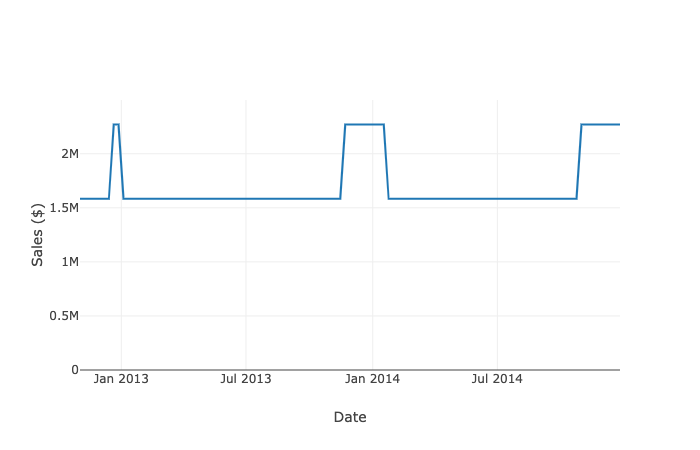
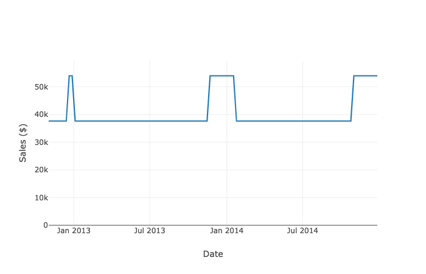
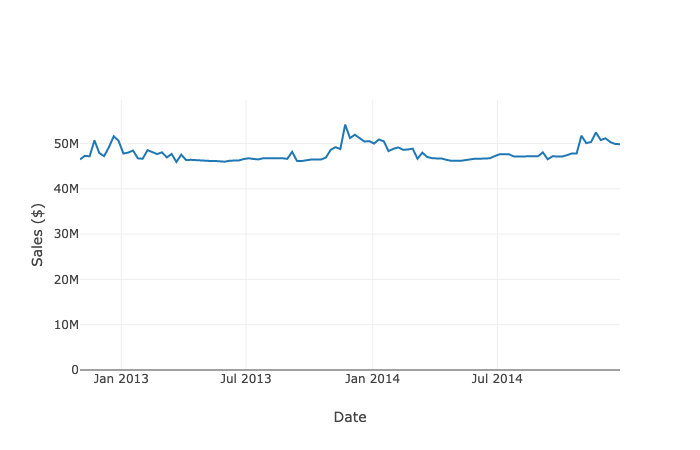

# Background
The goal of this part of the project is to rebuild a prediction model to improve the usefulness of the sales predictive model of the US Retail chain. This folder consist a file to visualize the prediction of the sales predictive model in Part 2 in a dashboard.

## Reason to Rebuild the Model
The sales predictive model for built for the US Retail chain in part 2 was overfitted; the prediction produced from the predictive model was not useful to the management. To be specific, the predictive model only predicts 2-3 values across 36 months period that the sales prediction that the values are not vary enough to be useful. Take the prediction in Store 1 for example, there is only 2 values of prediction from the sales predictive model that makes the prediction does not differ from taking historical sales average, like this:
 

  
Due to the calculation of department sales is taking store sales times the proportion of sales relative to store sales, the same problem happens on department sales, take Department 4 in Store 1 for example:
 

 
It also results of the failure to capture the trend and seasonality of overall sales across all stores.
 

## File
This folder consists of <i>Dashboard_OldSales.py</i> which program to power a dashboard to visualize overall sales (Sales of all stores), store-wide sales, and department-wide sales within one store. The file imports the data from the prediction in the [Prediction Model folder (Coming Soon)](/) in the [Part 2 - US Retail folder (Coming Soon)](/). The dashboard requires pandas, Plotly, and Dash.

## Gallery of the Dashboard
Coming Soon..

## Next Step
In the next step, we are going to re-visit the model training phase to select another suitable model for the sales prediction model, you may find more detail in the [Model Training folder](../ModelTraining).

