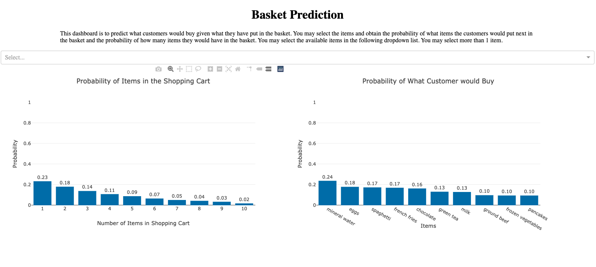
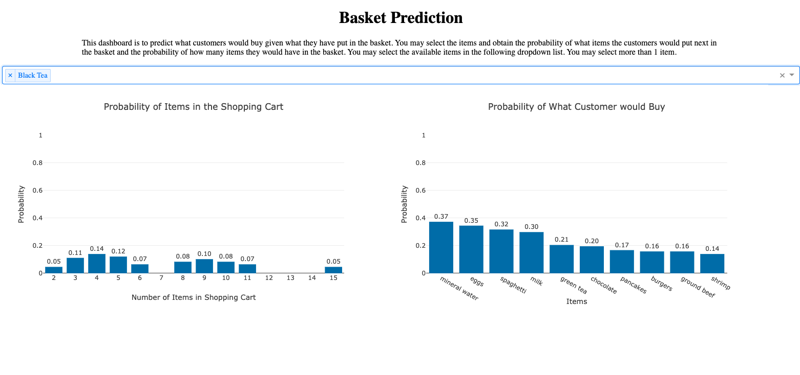
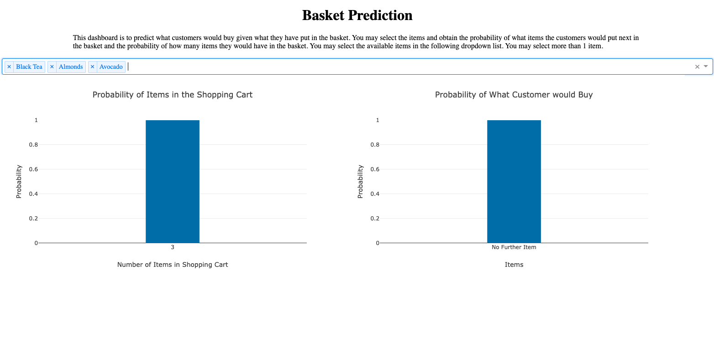

# Predict what Customers Purchase
The supermarket wants to understand what the customers put in their basket. In this phase, we will predict what customers purchase based on what the customers historically purchase in the basekets and display the result on a dashboard.

## Data
The data we used in this phase is MarketBasketOptimisation.csv (Basket data set). Although the file is saved as csv file, the data set is not in a tabular shape. Each line is represented as a transaction (a basket of grocery in a transaction), separated by comma. In here, each line ia a basket which is also a completed transaction. It means what each basket becomes a transaction. Therefore, a basket of items in here is the same as a transaction.

## Strategy
The idea of this dashboard is to display what the customer would buy given what they already have in the basket (Prior Item). For example, if the customer has a turkey in the basket, what else would the customer would buy and how many more items would the customer buy in this transaction.
  
The dashboard use Bayesian approch to calculate the probability of items customers would buy. Once the user has select a turkey on a dashboard, the program would subset a data set with only turkey transactions. Then the program would calculate the frequency of other items available in the supermarket divide by the transaction of the subset to produce the probability of each available items would be include in this basket. The program would also calculate the probability of all possible number of items in this basket.
  
There are 4 steps to build this dashboard. First, read the data set and convert to tabular shape for the convenience for filtering the data. Then, set up the dashboard layout. After that, define the functions to calculate the probabilities. Lastly, define call back functions to display the calculation. 

## Files
There are 4 files for the dashboard.
<ol>
	<li>BasketPrediction.py - Driver Program of the dashboard</li>
	<li>Layout.py - Helper code to define layout and generate charts</li>
	<li>ReadData.py - Helper code to read and engineer the data to return tabular shape and helping data set</li>
	<li>Prediction.py - Helper code to calculate probabilities</li>
</ol>

## Layout
There are 4 main component on the dashboard:
<ul>
	<li>H1 for Title</li>
	<li>P for Direction</li>
	<li>Div for Dropdown - Mulit-selection dropdown list for items available in the supermarket</li>
	<li>Div for Visualizations - 2 Bar Charts to display the probability of items in shopping cart and probability of the next item in the basket</li>
</ul>
 
The basic layout of the dashboard looks like this:
 

  
Note that the Div for visualizations contains 2 Div's which each Div contain a dcc.Graph(). The layout is defined in <i>BasketPrediction.py</i> and <i>Layout.py</i>.

## Data Engineering
The first step is to engineer the data set to tabular shape. <i>ReadData.py</i> read the Basket data set and obtain the items in each transaction. Then build a data frame with columns of items available in the supermarket. For each row represents a transaction; each column represent each item. All columns would be binary columns: For each item purchased in a transaction would be assigned to 1, or 0 for the items not purchased. Such data frame transcation would be easy for filtering condition and counting the frequency of each item relative to transactions.

## Probability Calculation
Since we have a tabular shape of data frame from the data engineering format, we subset the data set based on desired condition instructed by the user and calculate the probability. After the user has selected one or more prior items, the program would subset the data of the transactions which contain the selected prior items. Then, the program calculates the probability of all items by counting the frequency of each item and divided by the transactions in the subset. For example, if the user select turkey as prior items, then the program subset the transactions which turkey is purchased in the transactions. After that, it calculate probability of the next item purchased for all items by counting all the 1's in each column and divided by the subset transactions.
  
This is a naive approach to calculate probaility of next item purchased in this basket as we treat next-item-purchased-items as independent variables and ignore the correlation among items. It means we simply calculate probability on each item. Potentially we could have more than 1 next-item-purchased be 1.0 probability; it simply means the condition instructed by the users, the customers would purchase all those items based on pervious data.

## ReadData.py
This is the helper code to read data and convert to tabular shape data frame. There is only 1 function which takes the file path to read the data set. This helper code relies on Pandas and Numpy for data processing. First, once the function read the data and split each line into list and collect the all items available in the data set. Then, the function build a column for each item and assign 1 for item purchased and - for item not purchased on each transaction. After that, it add a column to indicator number of items purchase in this transaction. The function return a dictionary of features needed for the dashboard, it includes:
<ul>
	<li><i>transaction_tabluar</i> - The Pandas data frame of transactions indicates what items were purchased and the number of items purchased in each transaction</li>
	<li><i>cols</i> - The list of columns in <i>transaction_tabluar</i></li>
	<li><i>product2num</i> - Dictionary convert items in string to numbered label</li>
	<li><i>num2product</i> - Dictionary convert numbered label to items in string</li>
	<li><i>products_num</i> - Number of items available in this supermarket, integer</li>
</ul> 

## Prediction.py
This is the helper code to calculate the probabilities of each next-item-puchased-item. There is only 1 function in this code, getProb(). The function is called in <i>BasketPrediction.py</i> to obtain the probabilities of each item as the next-item-purchased. It requires 2 inputs - df and items. df is the transaction in tabluar form, and items is the list of prior item(s) selected by the user. If there is one or more prior item, the function subset the df with transactions with prior item(s). Then, the function calculates the probability of each item not in the prior item(s) list by counting 1's in each column divided by the rows of the subset data set. The function also calculates the probability of number of items in shopping cart by counting the frequency of each available number of items by the rows of the subset data set. The function returns 2 lists: One return the probability of probability of number of items in shopping cart and one return the probability of each item as next-item-purchase. Both list contains a list of tuple: keys are features, values are probabilities.

## Layout.py
This is the helper code to define the layout of the dashboard and generate the visualizations. There 2 functions define layout: get_div_dropdown() and get_div_vis() and 1 function to generate a bar chart: getBarChart(). get_div_dropdown() takes the list of options available in the dropdown list and generate a multi-value dropdown list. get_div_vis() returns a static div of visualization. The static div contains 2 div in parallel position, each div contains a dcc.Graph() component. The left div is to diplay a bar chart of probability of items in shopping cart; while the right div display the probability of the items be the next-item-purchased in the shopping cart. If there is no next-item-puchased item, the right bar chart would be display the probability of "No further item" to indicate that.

## BasketPrediction.py
The driver program to run the dashboard. There are 3 parts of this program: Data Preparsion, Dashboard layout, and Dashboard Callbacks. The Data Preparsion part relies <i>ReadData.py</i> to read and engineer the data set. Then, the program call <i>Layout.py</i> to define the layout of the dashbaord. Finally, the dashboard recieves the inputs from user, call <i>Prediction.py</i> to calculate probabilities and call <i>Layout.py</i> to update the visualizations. The program default the top 10 features for both visualizations. 

## Screenshots
The default setting looks like this:
 

  
If one item selected, it looks like this:
 

  
If ther is no next-item-purchased be predicted, it looks like this:
 

## Conclusion
This is the last phase of this part of the project. You may find the conclusion in the <a href="https://github.com/jacquessham/SalesAnalytics/tree/master/USSupermarket">front page</a>.