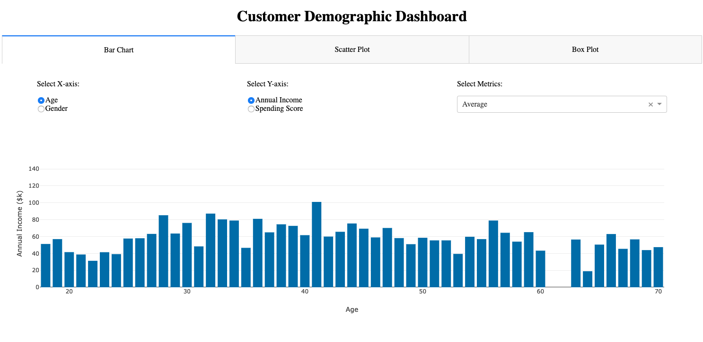
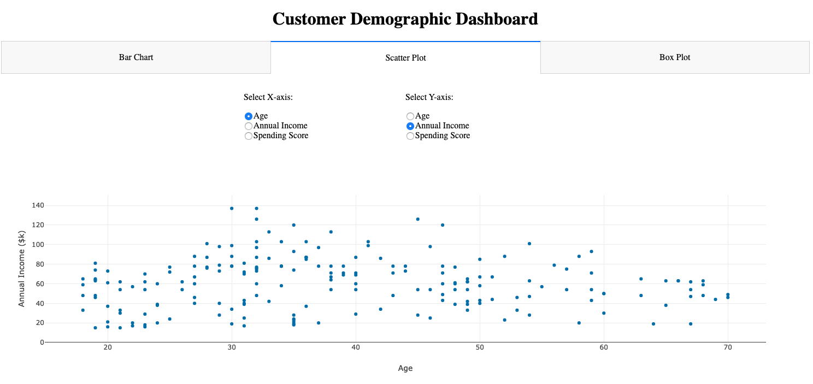
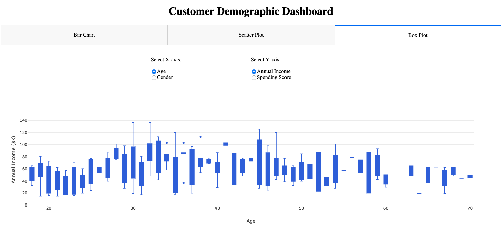

# Customer Dashboard
The goal is to build a dashboard to display the Supermarket Chain Customer Demographic. 

## Background and Strategy
Although we have obtained some business insight from conducting A/B testing, dashboard is a good tool to have the managers to understand the customer demographic more effectively. In this phase, we will use Dash to build a dashboard to display the visualize the relationship on customer demographic and customers' spending satisation.

## Files
There are 2 python files in this folder:
* CustomerDashboard.py - Driver program to run the dashboard
* Layout.py - Helper code to define the layout of the dashboard

## CustomerDashboard.py
This is the driver program to run the dashboard. The program contains 3 parts:
<ol>
	<li>Data Preparation</li>
	<li>Dashboard Layout</li>
	<li>Dashboard Callbacks</li>
</ol>
 
In Data Preparation, the program use Pandas to read csv file, which is the data the program use [Customer data](../Data/Supermarket_CustomerMembers.csv). You may find more detail in the [data folder](../Data). In this program, the layout is defined with only 2 main components: H1 and Tabs. Within Tabs, it contains 3 tabs to represent 3 visualization choices from users. Each tab layout is defined from the <i>Layout.py</i> file. The 3 tabs are:
<ol>
	<li>Bar Chart</li>
	<li>Scatter Plot</li>
	<li>Box Plot</li>
</ol>
 
Each tab has its own layout and call back function because Dash requires all id's to be defined initially and each id cannot be used more than once for Input()'s.
 
 
There are 3 callback functions to update the visualizations. Each callback function is built for each tab's visualization. There are 3 functions:
<ol>
	<li>update_barchart()</li>
	<li>update_scatterplot()</li>
	<li>update_boxplot()</li>
</ol>
  
### update_barchart()
This function requires 3 inputs from the Bar Chart tab:
<ol>
	<li>X-axis feature - Age and gender only</li>
	<li>Y-axis feature - Annual Income and Spending Score only</li>
	<li>Metric - Includes Mean, Median, Minimum, Maximum, Mode</li>
</ol>
In this bar chart, it is design to display annual income or spending score relatively to age or gender. There are more than 1 observation for either x-axis feature, therefore, we need to ask user a metric to display the aggregation of the data by the feature. Once the user has selected all inputs, the function would obtain the aggregated data with pandas. Note that mode is not available in Pandas, the function has a lambda function to calculate mode with scipy.stats. Once the data is manipulated, the data will be added to dictionary for the Plotly figure. Also, the function edits the hover textbox to the desired format. If the X-axis feature is gender, the width will be set to 0.2 to shrink the bar because the plot is too wide for 2 bars. Note that, the y-axis range will be set to be the maximum of data plus 10%. 

### update_scatterplot()
This function requires 2 inputs from the Scatter Plot tab:
<ol>
	<li>X-axis feature - Age, Annual Income, and Spending Score only</li>
	<li>Y-axis feature - Age, Annual Income, and Spending Score only</li>
</ol>
In this scatter plot, it is designed to plot all two of the features with continuous data. Therefore, there is no aggregation needed in this function. When building the figure, the function directly pass the selected pandas column to x and y parameters. Like update_barchart(), the y-axis range will be set to be the maximum of data plus 10%.

### update_boxplot()
This function requires 2 inputs from the Bar Chart tab:
<ol>
	<li>X-axis feature - Age and gender only</li>
	<li>Y-axis feature - Annual Income and Spending Score only</li>
</ol>
In this box plot, it is design the data distribution of data relative to the x-axis feature. To manipulate the proper data set, the function first obtain the unique value of age or gender. For each age or gender, the function uses pandas to filter the data correponses to each age or gender and add to the box plot. Like update_barchart(), the y-axis range will be set to be the maximum of data plus 10%. In default setting, each box is coloured with different colour; the function has set fillcolor and line to be royal blue to return a consistent colour box plot.

## Layout.py
The <i>Layout.py</i> program is a helper code for <i>CustomerDashboard.py</i>. First, it defines the headline and axis title for the dashboard and the visualizations. Then, there are 3 Tabs() layout defined.
<ol>
	<li>tab1_layout - Layout for Bar Chart tab</li>
	<li>tab2_layout - Layout for Scatter Plot tab</li>
	<li>tab3_layout - Layout for Box Plot tab</li>
</ol>
Each tab layout are similar, it contains:
<ol>
	<li>Div for options</li>
	<li>dcc.Graph()</li>
</ol>
The only difference among 3 structures is Div for options. For tab2_layout and tab3_layout, it contains only 2 radio item list for users to select x-axis and y-axis features. For tab1_layout, there is a extra dropdown list for user to select the metric for the bar chart.

## Result
There are 3 screen shot for each visualization. For the bar chart, it looks like this:
 

  
For the scatter plot, it looks like this:

  
For the box plot, it looks like this:

## Next Step
In the next phase, we are going to make predictions on what customers purchase based on what they have in the basket. You may find that more in the [Basket Prediction folder (Coming Soon)](/)