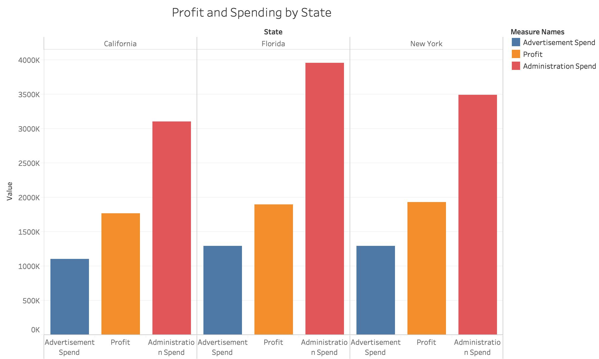
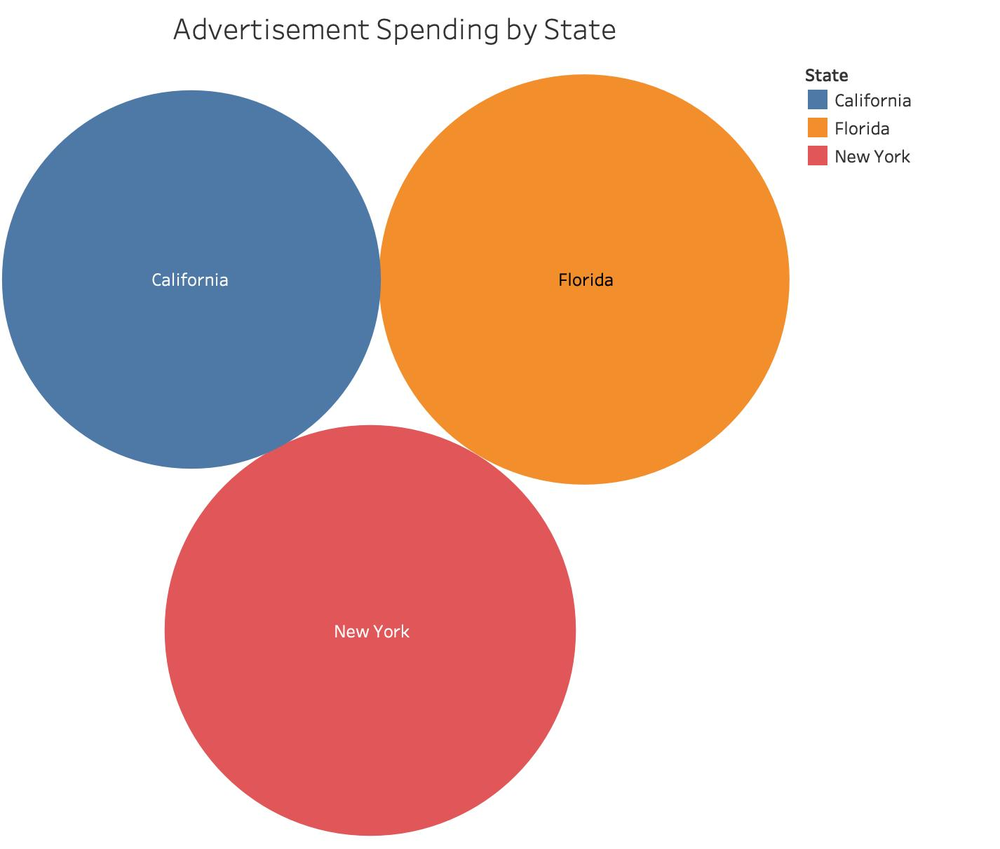
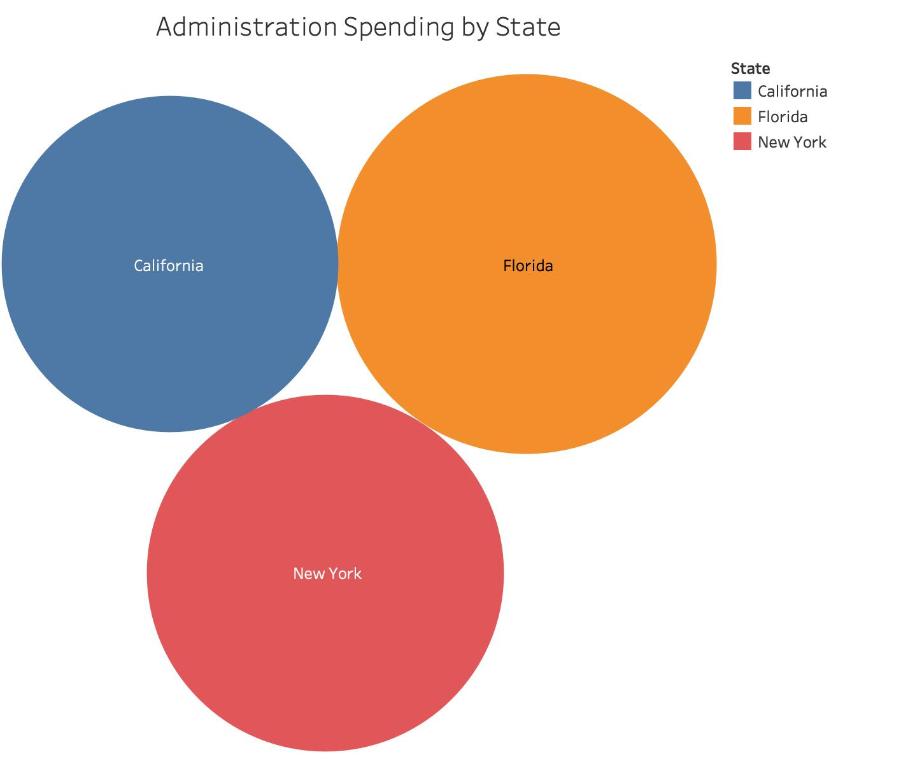
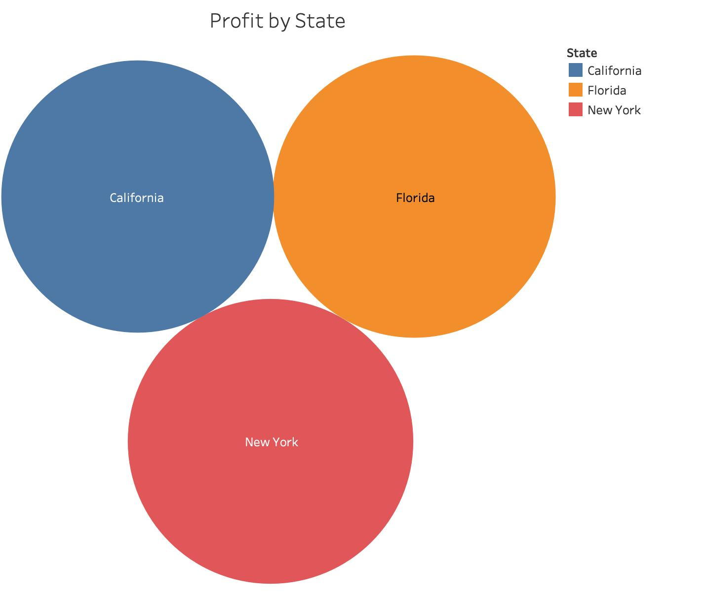

# Exploratory Data Analysis
Before we do anything in this project, we will first explore the data set first. In this folder, there are 3 Tableau files to visualize the data set: <i>SupermarketBranchEDA.twb</i>, <i>CustomerEDA.twb</i>, and <i>Ad_Count.twb</i>.

## Supermarket Branches
The US supermarket chain operates in 3 states: California, Florida, and New York. In the data set, it contains the advertisemnet spending, administration spending, and profit for each store. 
 

  
The advertisement spending and profit from branches from all states are about the same. The administration spending in Florida is slightly higher than the stores in California and New York.
  

  

  

## Advertisement
The US supermarket chain has 10 advertisement campaigns. The following bar charts visualizes the click-through rates of each campagin.
 

## Next Step
After looking the data set, there are some questions which can help the management improve the business. The questions can be answered by conduing A/B testing, you may find more details in the [A/B Testing folder](../Abtesting).

