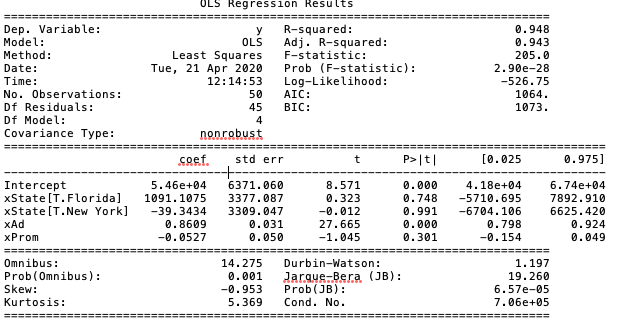

# Interpret the Spending Effects on Profit
In this phase, we will fit the store data set in a linear regression model in order to interpret the spending effects on profit.

## Background and Strategy
The store data set provides the spending on advertisement, promotion, administration, and profit of the supermarket stores located in New York, California, and Florida. In this phase, we would like to interpret how the spendings have an effect on profit of each store. We are going to train a linear regression model to interpret effects. The reason we use linear regression model because it is very easy to explain and interpret. We will use statsmodels as their statistical summary provides more detail than sklearn.

## Packages Used
* Pandas - Read csv file and data manipulation
* statsmodels - Fit model and return statistical summary

## statsmodels
statsmodels is a R-like Python package. The syntax used in statsmodel is very similar to R but run in Python. statsmodels is a statistic package which provides a better summary and statistic-forced functionality than sklearn does.

## Files
There are 1 python code and 1 text file. The text file is the anova summary of the model. 
* ussupermarket_sales.py - Code to fit model with store data and save the anova summary
* summary.txt - Anova Summary of the model

## Features Used
I have only selected advertisement, promotion, state in the linear regression model. The reason administration spending is not select because this is a fixed cost of the store. It means the revenue or profit does not vary based on adminstration spending. Note that state is not a continuous value, statsmodel will automatically convert this column to be one-hot-encoding columns.
* xState - Variable stored the State column
* xProm - Variable stored the promotion spending column
* xAd - Variable stored the advertisement spending column

## Result
The result looks like this:
 

  
From the result above, we can see that the coefficient of xAd and xProm are 0.8609 and -0.0527. It means for every dollar spent on advertisement, it increases 86 cents in profit on average; however, for every dollar spent on promotion, it decrease 5 cents in profit on average. The coefficient of xState of Florida and New York are 1091.10 and -39.34. It means on average the stores in Florida has $1091.10 cents more in profit, while the stores in New York on average has $39.34 less in profit.
  
The Adjusted R-Square of this model is 0.943 which means the model fits very well with the data.
  

## Conclusion
After we have trained the model, we found that on advertisement spending is effective on increasing profit. We recommend the supermarket stores to increase advertisement spending and limit promotion spending in order to increase profit. If there is an expansion, we recommend the supermarket to set up new store either in California or Florida.

## Next Step
In the next phase, we are going to build a dashboard to display the customer demographic for managements to understand the customers data insight. You may find the dashboard in the [Customer Dashboard folder](../CustomerDashboard).